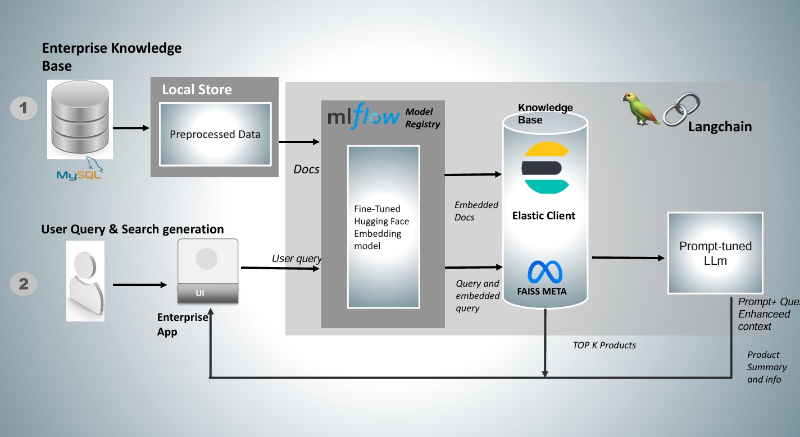

# 🔍 AI-Powered Search Engine

Welcome to the AI-Powered Search Engine, an intelligent and dynamic search solution combining advanced **hybrid Search [Dense + sparse & Rerankers]** **Visual Search**, and **LLM-powered Recommendations**. Designed to revolutionize product discovery in e-commerce and knowledge bases, this system helps users effortlessly find the most relevant products or services.

---

 

Here's how our AI-powered search engine looks in action:


## 🚀 Features

### 1. **Semantic Search**
- **Sentence Transformers**: Efficient semantic embeddings for contextual matching.
- **FAISS Vector Store**: Fast similarity search powered by cosine similarity.


### 3. **Visual Search**
- **Image Similarity**: Quickly finds visually similar items using image embeddings and efficient nearest-neighbor retrieval.

### 4. **Hybrid Search**
- Combines Dense (Semantic) and Sparse (Keyword) retrieval methods for comprehensive results.

### 5. **Cross-Encoder Re-ranking**
- Improves search quality by re-ranking initial search results based on query relevance.

### 6. **LLM-Enhanced Recommendations**
- Uses Large Language Models (LLMs) like LLaMA for generating personalized and context-aware recommendations and summaries.

### 7. **Retrieval-Augmented Generation (RAG)**
- Integrates retrieval methods with generative models to provide contextually accurate, informative, and coherent responses based on retrieved knowledge.
- Utilizes LangChain and Pinecone for efficient context retrieval and dynamic query handling.

### 8. **User-Friendly Interface**
- Built with **Streamlit**, ensuring a smooth, interactive, and intuitive user experience.

---

## 🛠️ Tech Stack

- **Frontend**: Streamlit
- **Backend**: FastAPI
- **Semantic Models**: Sentence-BERT, CrossEncoder
- **Vector DB**: FAISS
- **Search Engine**: Elasticsearch
- **LLM Integration**: LangChain, LLaMA, LangGraph
- **Model Tracking**: MLflow
- **Monitoring & Logging**: Kibana

---

## 🎯 How It Works

1. **Text/Visual Query**: User inputs a query or uploads an image.
2. **Search & Retrieve**: AI-powered retrieval engines fetch relevant results.
3. **Re-ranking**: Cross-Encoder re-ranks based on detailed relevance.
4. **Contextual Generation (RAG)**: Context retrieved using dense and sparse methods is fed into LLM to generate comprehensive answers and recommendations.

---

## 🧪 Model Management (MLOps)

- **MLflow Integration**: Tracks experiments, logs models, and manages deployments.
- **Automated Model Promotion**: Streamlined workflows for staging and production.
- **Continuous Integration & Delivery (CI/CD)**: Automates testing, deployment, and monitoring, ensuring reliable and efficient updates.
- **Versioning & Governance**: Clear version control and model governance strategies for reproducibility and compliance.
- **Monitoring & Alerting**: Real-time tracking of model performance and usage with automated alerts for anomalies or performance degradation.[yet to update]

---
## 🚀 High Level Architecture 

Here's how our AI-powered search engine looks in action:




## 🚦 Getting Started

### **Installation**
Clone this repository:
```bash
git clone https://github.com/yourusername/ai-search-engine.git
cd ai-search-engine
pip install -r requirements.txt
```

### **Configuration**
Create your `config.yaml` file based on `config-example.yaml` provided.

### **Run Application**
Start Streamlit app:
```bash
streamlit run streamlit/app.py
```

Start API:
```bash
uvicorn api.hybrid:app --reload
```

---

## 📚 Documentation & Support
- Check out [Docs](docs/) for detailed architecture, deployment instructions, and API guides.
- For support, raise an issue or submit a pull request.

---

## 🤝 Contributing
We welcome community contributions:
- Fork this repo
- Create your feature branch (`git checkout -b feature/my-feature`)
- Commit your changes (`git commit -m 'Add some feature'`)
- Push to the branch (`git push origin feature/my-feature`)
- Open a Pull Request

---

## 📜 License
Distributed under the MIT License. See [`LICENSE`](LICENSE) for more information.

# Jsearch_ai project
